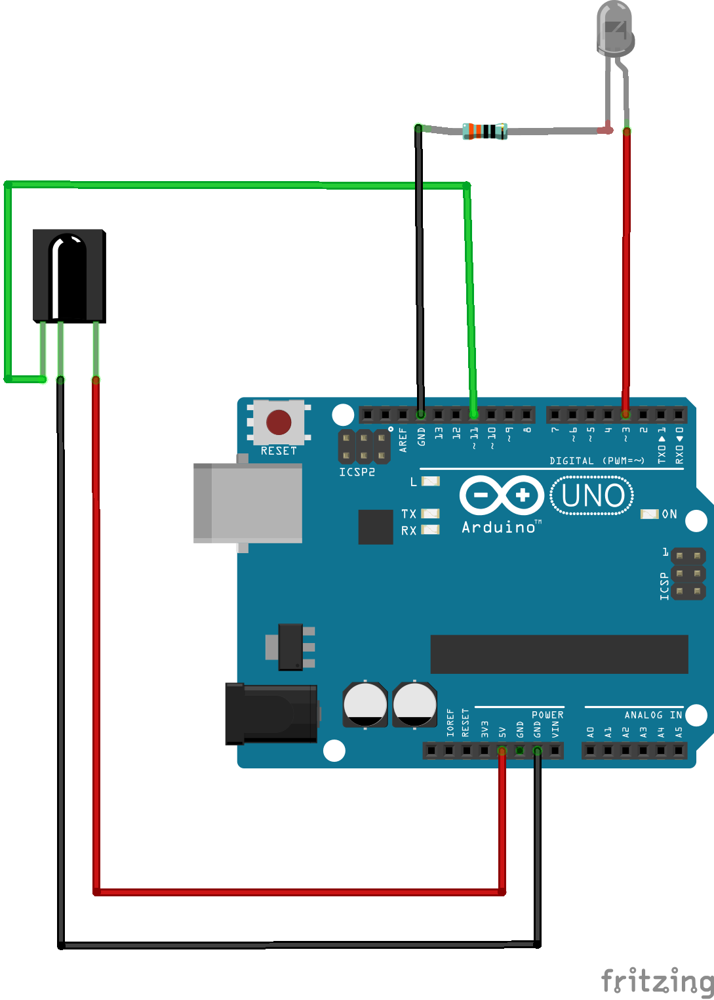
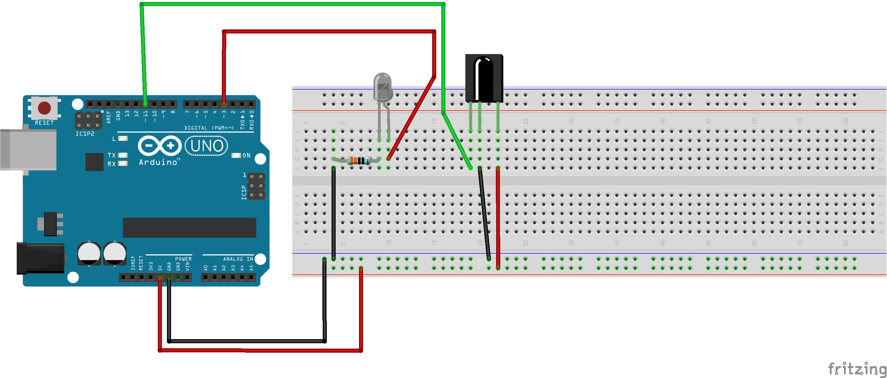

# Arduino: Infrared Communication

## Installing the library
First, you'll need to grab [z3t0's IR Remote Library](https://github.com/z3t0/Arduino-IRremote/archive/master.zip). The easiest way to do this is to (in the Arduino DE) click Tools->Manage Libraries.

Search for "irremote" and install "IRremote by shirriff".

## Circuit



## Circuit on Breadboard


## Code

These first code samples are based on examples from that library's Github Repo (see link above).

### Read a Remote

Read a raw numeric IR code from your remote.

```
#include <IRremote.h>
int RECV_PIN = 11;
IRrecv irrecv(RECV_PIN);
decode_results results;
void setup()
{
  Serial.begin(9600);
  // So the user can watch the serial terminal to see what's going on.
  Serial.println("Enabling IR Reader");
  irrecv.enableIRIn(); // Start the receiver
  Serial.println("Enabled IR Reader");
}
void loop() {
  if (irrecv.decode(&results)) {
    Serial.println(results.value); //replace with "results.value, HEX" to get HEX codes.
    irrecv.resume(); // Receive the next value
  }
  //pause for a moment (100ms) to avoid confusion.
  delay(100);
}
```

### Remote control an LED

Use a specific pin code to control the LED on your Arduino Uno board.

```
#include <IRremote.h>
int RECV_PIN = 11;
IRrecv irrecv(RECV_PIN);

float button_code = 547182759;

decode_results results;

void setup()
{
  Serial.begin(9600);
  // In case the interrupt driver crashes on setup, give a clue
  // to the user what's going on.
  Serial.println("Enabling IRin");
  irrecv.enableIRIn(); // Start the receiver
  Serial.println("Enabled IRin");
  pinMode(13, OUTPUT);

}

void loop() {
  if (irrecv.decode(&results)){
    if(results.value == button_code){
      Serial.println("Light on");
      digitalWrite(13, HIGH);
      delay(500);

    }
    Serial.println(results.value);
    irrecv.resume(); // Receive the next value
    digitalWrite(13, LOW);
  }
  delay(100);
}
```

### Send an IR code

```
/*
 * IRremote: IRsendDemo - demonstrates sending IR codes with IRsend
 * An IR LED must be connected to Arduino PWM pin 3.
 * Version 0.1 July, 2009
 * Copyright 2009 Ken Shirriff
 * http://arcfn.com
 */


#include <IRremote.h>

IRsend irsend;

void setup()
{
}

void loop() {
	for (int i = 0; i < 3; i++) {
		irsend.sendSony(0xa90, 12);
		delay(40);
	}
	delay(5000); //5 second delay between each signal burst
}
```
### Transmit from one Arduino to another

Two sketches for this one. One for the transmitting Arduino board (sender) and one for the receiving Arduino board (recipient).

These sketches are based on code from [this instructable](https://www.instructables.com/id/Cheap-wireless-transmission-between-two-Arduinos-w/) by Yoruk.

#### sender
```

String message = "";
#include <IRremote.h>
IRsend irsend;

void setup()
{
  Serial.begin(9600);
  int i=0;
}

void loop() {
  String message = "Welcome to MakerspaceCT";  
  Serial.println( message);

  //send the characters over the IR
  for (int i = 0; i < message.length(); i++){

    irsend.sendRC5(message.charAt(i), 12);
    delay(20);

    Serial.print("TX:");
    Serial.println(message.charAt(i));

  }

  irsend.sendRC5(13, 12);  //send a RETURN
  irsend.sendRC5(10, 12);

  //delay 1.5 seconds before sending next letter.
  delay(1500);

}
```
#### reciever
```

#include <IRremote.h>

int RECV_PIN = 11;
IRrecv irrecv(RECV_PIN);
decode_results results;

void setup()
{
  Serial.begin(9600);
  irrecv.enableIRIn(); // Start the receiver
}

void loop() {

  //send the incoming data over the serial port

  if (irrecv.decode(&results)) {
    Serial.print(char(results.value));
    irrecv.resume(); // Receive the next value    
  }
}
```


## Notes
not yet.

## What's next?
* Terry Field wrote up some sample code for a more complex transmission method that includes a method for message checksums. It takes more to get set up, but you can check it out [here](http://www.terryjfield.com/?p=139).

* Check out Sparkfun's [Getting Started with IR](https://learn.sparkfun.com/tutorials/ir-communication/all) page.

* What appliances do you have at home that use infrared remotes? I control my air conditioner with an ESP8266 (wifi-enabled Arduino-compatible board).

* What remotes do you have that don't use infrared light? What do they use instead?
   * The original Amazon FireTV Stick remote used WiFi-direct, and the new one uses Bluetooth, neither of which depend on line-of-sight  communication.
   * Some devices use remotes that emit sound inaudible to human ears. This presents different opportunities and different challenges.
